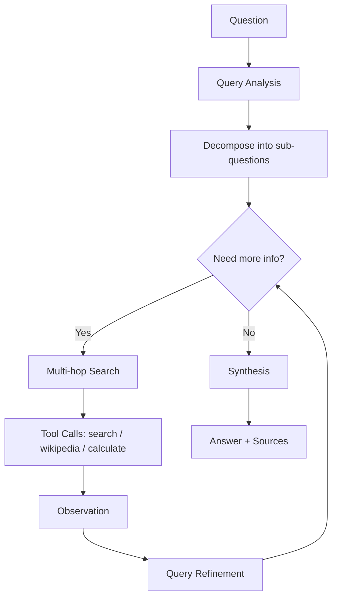

# Search System Architecture Flowchart

```mermaid
flowchart TD
    A[Question] --> B[Query Analysis]
    B --> C[Decompose into sub-questions]
    C --> D{Need more info?}
    D -- Yes --> E[Multi-hop Search]
    E --> F[Tool Calls: search / wikipedia / calculate]
    F --> G[Observation]
    G --> H[Query Refinement]
    H --> D
    D -- No --> I[Synthesis]
    I --> J[Answer + Sources]
```

Notes:
- The **tools** use deterministic mock data under `src/tools/mock_data/`.
- Telemetry is written to `logs/` to support RCA and evaluation.
