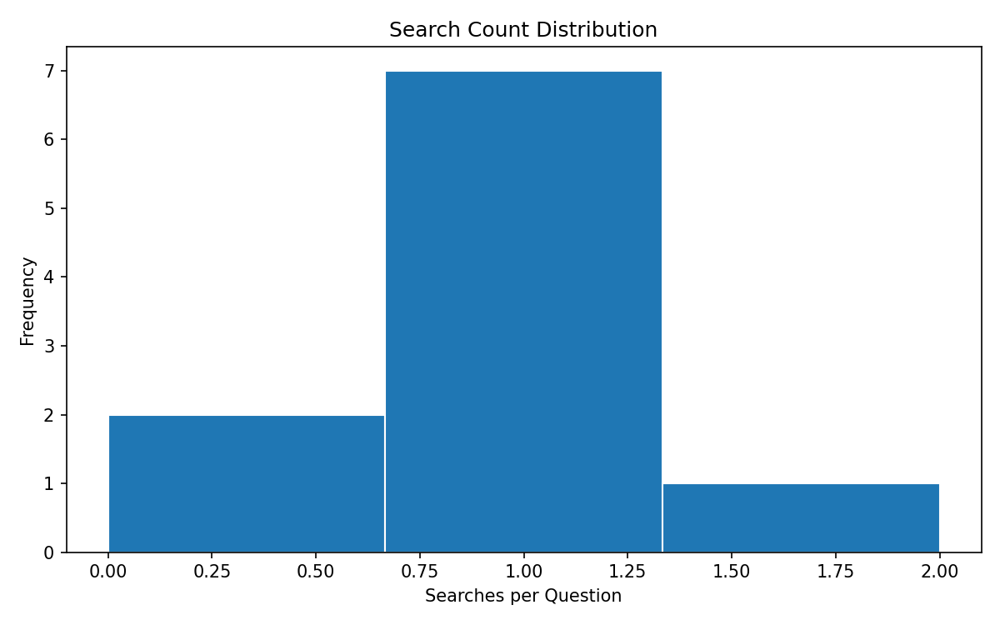
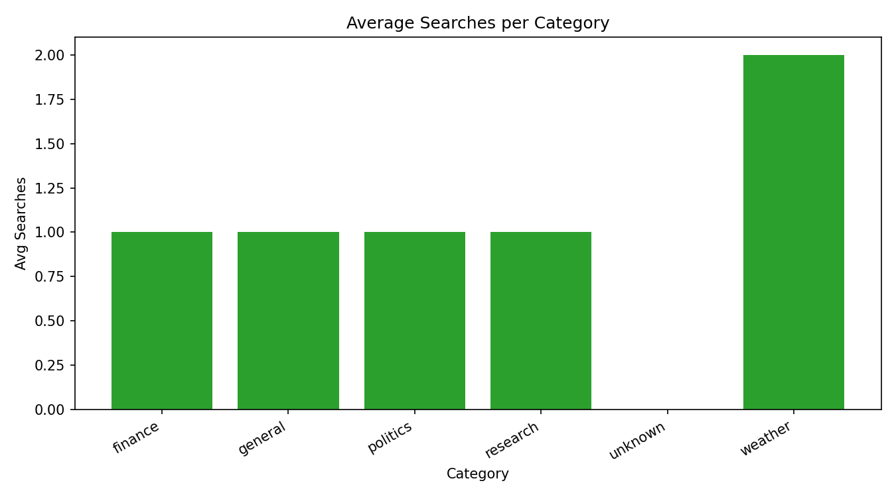
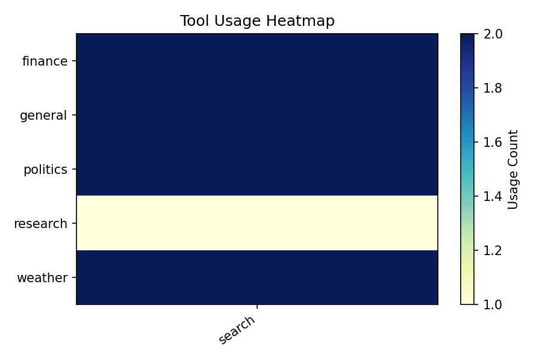
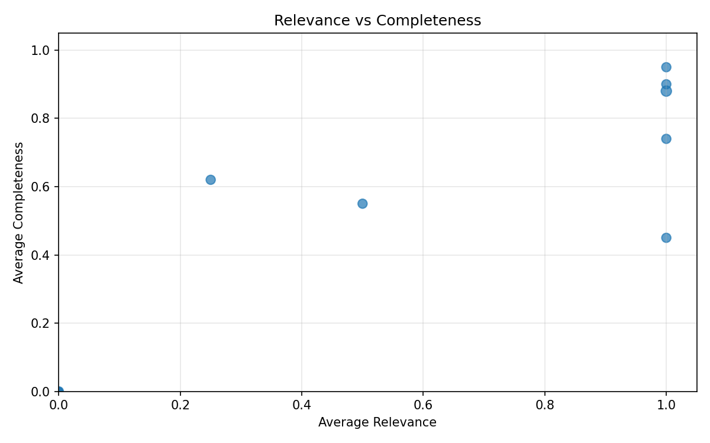
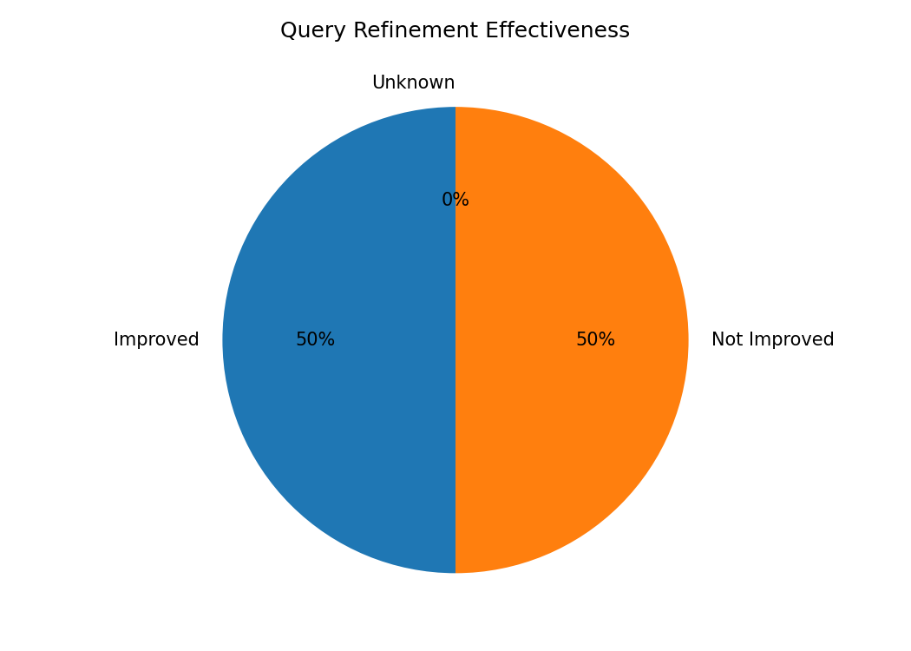
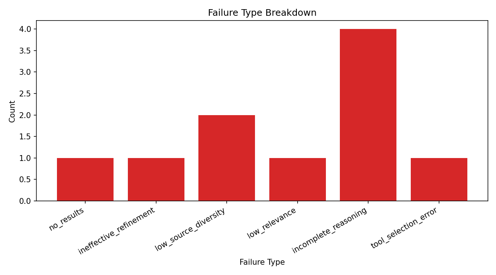
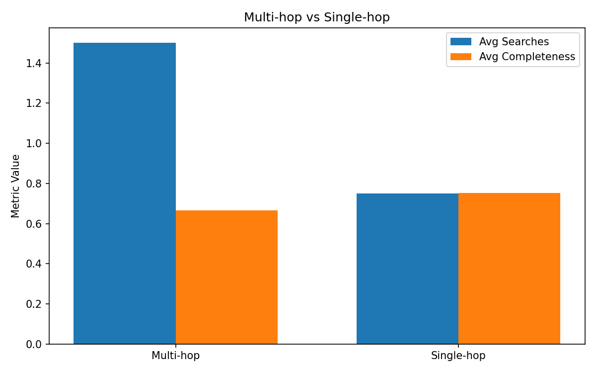

# Search Metrics Dashboard

## KPI Summary

- **total_sessions**: 10
- **search_efficiency_avg_searches_per_question**: 0.9
- **relevance_score_avg**: 0.8214285714285714
- **answer_completeness_avg**: 0.7271428571428571
- **source_diversity_avg**: 2.125
- **failed_search_rate**: 0.1111111111111111
- **explicit_failure_count**: 2
- **total_failure_cases**: 10
- **multi_hop_rate**: 0.2
- **query_refinement_success_rate**: 0.5
- **query_refinement_total**: 2
- **query_refinement_flagged_improved**: 1
- **query_refinement_flagged_total**: 2
- **analyzer_version**: 1.0.0

## Visualizations

### Search Count Distribution

### Average Searches by Category

### Tool Usage Heatmap

### Relevance vs Completeness

### Query Refinement Effectiveness

### Failure Type Breakdown

### Multi-hop vs Single-hop

